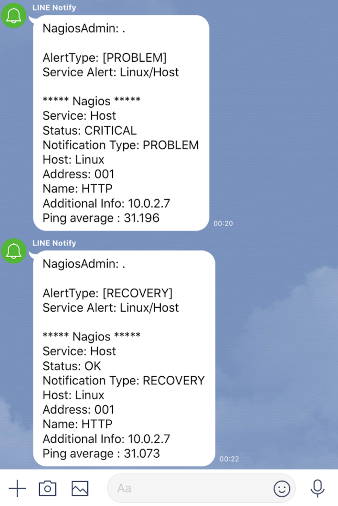
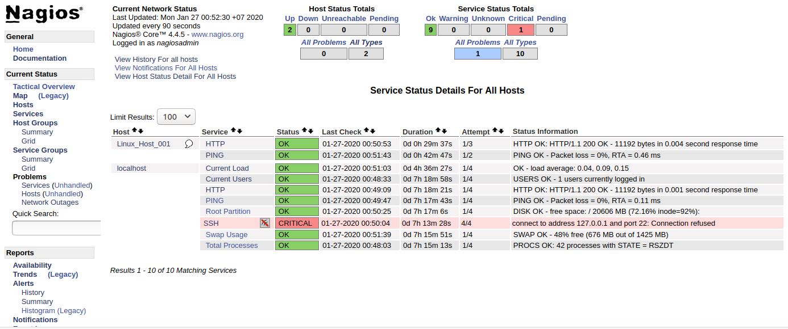
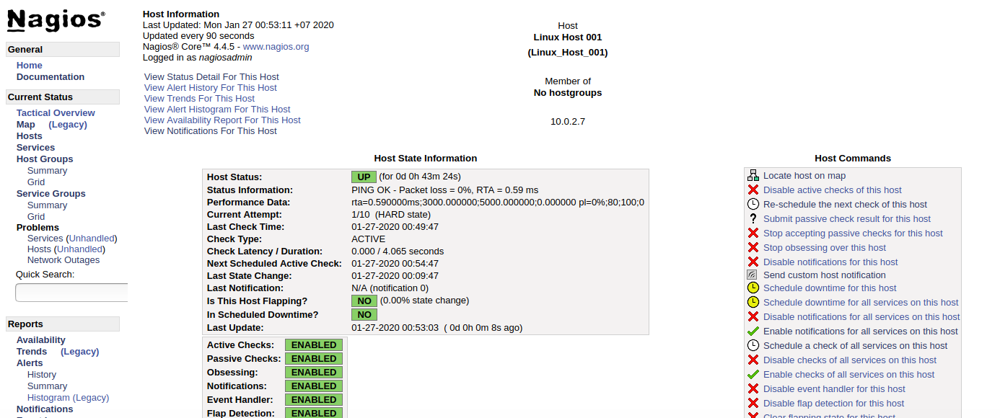
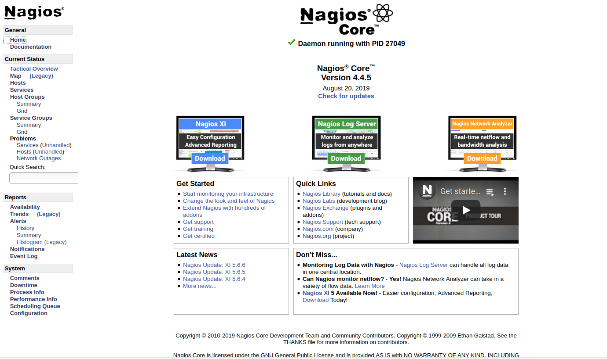

# Nagios-Line-Notification

## Getting Start with Line

1. Sign in Line from link >> https://notify-bot.line.me/en/
2. Click Account >> MY Page >> Generate Token 
3. Choose your group to notify (You must add friend named "Line Notify" to your group)
4. Copy your key and paste to file "line.sh" 

    Ex. `"Authorization: Bearer 123AWES231AWE12345"`

## Getting Start with Nagios

1. Copy command.cfg to your Nagios command.cfg
  Ex. Path `/usr/local/nagios/etc/objects/commands.cfg`
2. Verify configuration
  Ex. `sudo /usr/local/nagios/bin/nagios -v /usr/local/nagios/etc/nagios.cfg`
3. Restart Nagios service
  `sudo service nagios restart`

## Image

